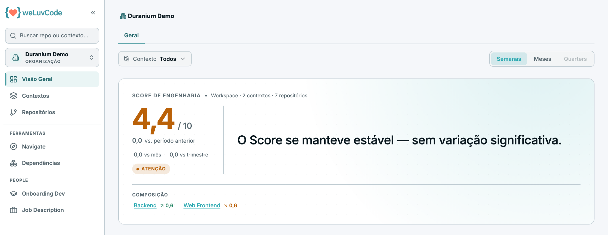

# 1. Visão geral

O WeLuvCode (WLC) analisa os repositórios de um workspace e traduz o
resultado em um indicador único, o **Score de Engenharia**, acompanhado da
documentação técnica que a plataforma gera a partir do próprio código.

## O Score de Engenharia

O Score vai de 0 a 10 e é a média ponderada de quatro dimensões:

| Dimensão | O que observa |
| --- | --- |
| **Fluxo** | ritmo e continuidade da entrega |
| **Qualidade da Engenharia** | características do código produzido |
| **Eficiência** | aproveitamento do esforço de engenharia |
| **Riscos** | exposições identificadas na base |

O Score só é calculado quando há dados suficientes: o produto exige **pelo menos
três das quatro dimensões**. Enquanto isso não acontece, a tela do repositório
informa que o cálculo ainda está em andamento, em vez de exibir um número
incompleto.

As dimensões não pesam igual, cada uma reúne vários indicadores, e alguns
indicadores podem reprovar a dimensão inteira sozinhos. Isso está detalhado em
[Métricas](m1-03-metricas.md), que também explica o que o Score deliberadamente não
mede.

## A hierarquia

O produto organiza tudo em três níveis, e o Score existe em cada um deles:

```
Workspace    →    Contexto    →    Repositório
a empresa         o domínio        o código
```

Um **contexto** é um agrupamento lógico de repositórios por produto, domínio ou
squad. No workspace de demonstração há dois contextos, Backend e Web Frontend,
somando sete repositórios.

O nível do workspace corresponde à empresa para quem tem perfil de
administrador. Para os demais perfis, ele corresponde ao que os seus grupos
concedem — o que está detalhado em [Workspace](m1-04-workspace.md).

## Onde cada coisa fica

A barra lateral esquerda é fixa e se adapta ao nível em que você está:

- **Visão Geral**, **Contextos** e **Repositórios** — navegação principal
- **Ferramentas** — Navigate
- **People** — Onboarding Dev e Job Description

No rodapé fica o seu usuário; no topo, o seletor de contexto e repositório.

> **Workspace e "Organização" são a mesma coisa.** O produto usa *Workspace* na
> maior parte das telas — no Score, no escopo do Navigate, nos filtros — mas o
> seletor da barra lateral rotula esse mesmo nível como *Organização*. Esta
> documentação usa **Workspace**, que é o termo predominante na interface.


