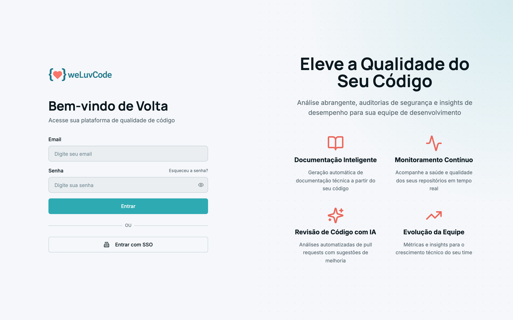
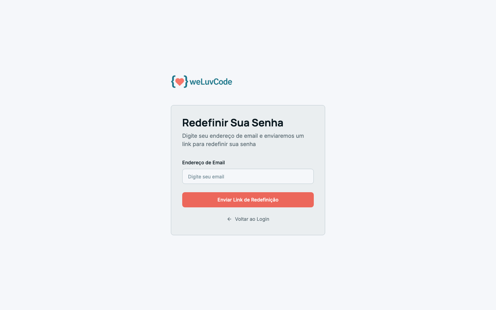
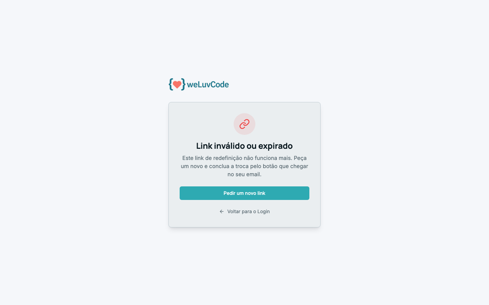

# 2. Acesso

## Entrar

A tela de login aceita dois caminhos: e-mail e senha, ou **Entrar com SSO** para
workspaces com autenticação corporativa configurada.

## Recuperar a senha

O link **Esqueceu a senha?**, ao lado do campo de senha, leva ao formulário de
recuperação. Você informa o e-mail e recebe um link para definir a nova senha.

Os links de redefinição têm validade. Se o link já tiver sido usado ou expirado,
o produto explica o que houve e oferece pedir um novo sem voltar ao início:

## Uma conta, um workspace

Cada e-mail tem acesso a um único workspace. Não existe troca de workspace
dentro do produto: para trabalhar em outro, é preciso uma conta com acesso a ele.

O seletor no topo da barra lateral, logo abaixo da busca, **não troca de
workspace** — ele navega entre os contextos e os repositórios do workspace em
que você já está. É por ele que se desce da visão geral para um contexto
específico, e de um contexto para um repositório.
