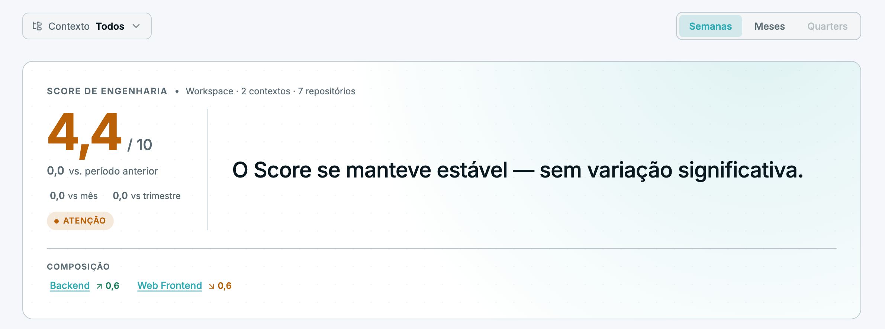
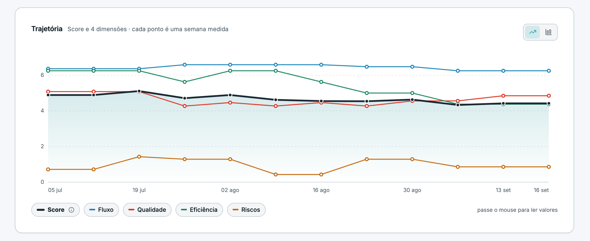
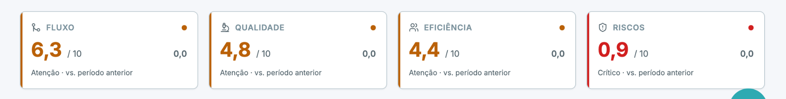
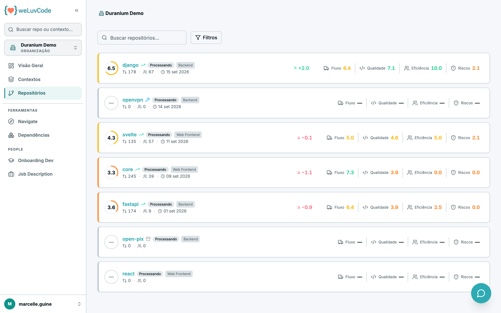
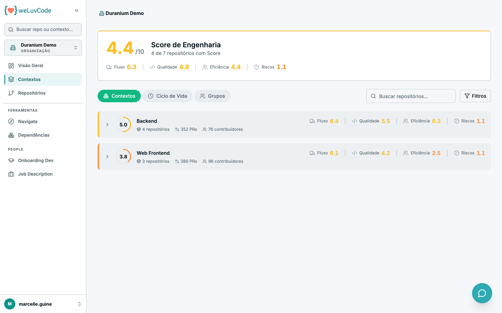
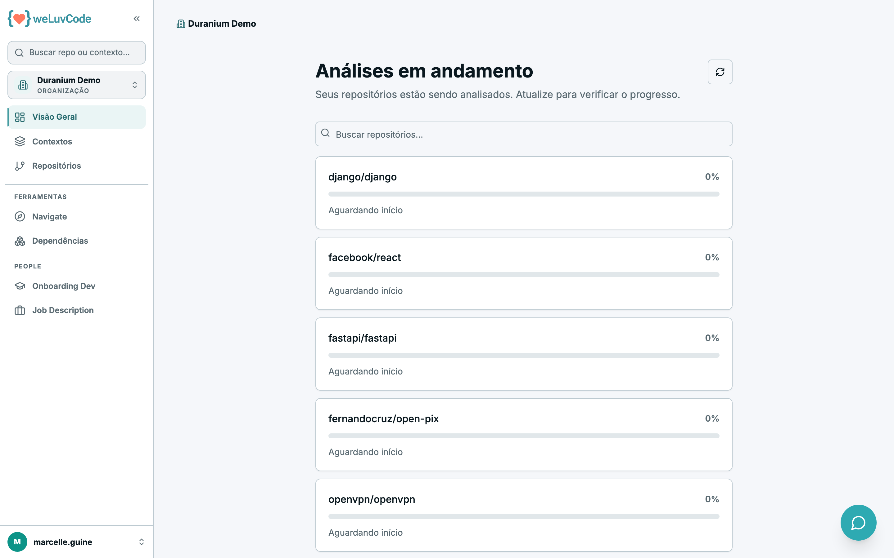

# 4. Workspace

## Visão Geral

É a tela inicial do produto: acessar a raiz leva direto para cá. Ela responde
"como está a engenharia deste workspace agora".

> A mecânica por trás destes números — pesos, indicadores, blockers e faixas —
> está em [Métricas](m1-03-metricas.md).

### O bloco do Score

O bloco superior traz o Score do workspace, o recorte a que ele se refere
(quantos contextos e repositórios entraram na conta) e um selo de estado:
**Saudável**, **Atenção** ou **Crítico**.

Ao lado, o produto escreve em texto corrido o que a variação significa,
nomeando o contexto que mais puxou o resultado para cima ou para baixo — e
distinguindo movimento concentrado em um contexto de movimento distribuído entre
vários.

### O que é "período anterior"

A variação compara **o último período fechado com o imediatamente anterior, na
granularidade selecionada**. Trocar a granularidade muda a comparação:

| Granularidade | A variação compara |
| --- | --- |
| **Semanas** | a última semana fechada com a semana anterior |
| **Meses** | o último mês fechado com o mês anterior |
| **Quarters** | o último quarter fechado com o anterior |

A seta indica a direção e a cor indica o sentido: verde melhorou, vermelho
piorou. Quando não há histórico suficiente, o produto informa que aquele é o
primeiro período registrado, em vez de exibir variação zero.

Logo abaixo aparecem **vs mês** e **vs trimestre**. Estes são outra coisa: em vez
de comparar com o período anterior, comparam o Score do período atual com a
**média** daquela janela mais longa. Servem para separar oscilação pontual de
tendência.

### Composição

Lista os contextos que formam o Score, cada um com sua contribuição. Os nomes são
links para a visão daquele contexto.

### Trajetória

Plota o Score e as quatro dimensões ao longo do tempo, um ponto por período
medido, com legenda por série. O botão ao lado do título alterna entre linhas e
barras. A série é reconstruída a partir do histórico do git, e não apenas do
período em que o repositório está conectado ao WLC.

### Cards das dimensões

Abaixo do gráfico, cada uma das quatro dimensões tem seu próprio card, com a nota
de 0 a 10, o estado (Saudável, Atenção ou Crítico) e a variação em relação ao
período anterior. É onde se vê rapidamente qual dimensão está puxando o Score.

### Filtro por contexto

O controle **Contexto**, no topo, limita toda a tela a um contexto específico ou
mantém a visão consolidada em "Todos".

## Repositórios

Lista todos os repositórios do workspace com busca e filtros.

Cada linha traz o Score do repositório, a tendência, o contexto ao qual pertence,
o status, a contagem de pull requests e de contribuidores, a data da última
medição e as quatro dimensões abertas.

### Os status

Quando um repositório aparece sem Score, o status explica o motivo:

| Status | Significado |
| --- | --- |
| **Processando** | a análise está em andamento; o Score aparece ao terminar |
| **Aguardando primeira coleta** | o repositório foi conectado, mas a primeira leitura ainda não rodou |
| **Sem atividade Git** | não há atividade suficiente no histórico para medir |
| **Score baixo** | o Score foi calculado e ficou em patamar que merece atenção |

O monitoramento de cada repositório também pode estar **Ativo** ou **Pausado**,
o que é configurado na administração.

## Contextos

O topo repete o Score do workspace, com o detalhe de **quantos repositórios já
têm Score** em relação ao total — informação que ajuda a calibrar a confiança no
número.

A lista tem três recortes dos mesmos repositórios:

### Contextos

Agrupa pelos contextos definidos na administração — produto, domínio ou squad.
Cada linha mostra o Score do contexto, a quantidade de repositórios, de pull
requests e de contribuidores, além das quatro dimensões. A seta à esquerda
expande a linha e revela os repositórios daquele contexto.

### Ciclo de Vida

Agrupa por estágio de maturidade. A classificação é **automática**, feita a partir
da atividade no git — idade do repositório, frequência de commits, pull requests
integradas e contribuidores ativos. São cinco estágios:

| Estágio | Critério |
| --- | --- |
| **Ativo em Construção** | criado há menos de 6 meses, ainda sem versão publicada, com commits no último mês e ao menos 3 PRs integradas por mês |
| **Ativo em Evolução** | já em produção (com versão publicada ou criado há 6 meses ou mais), commits no último mês, ao menos 3 PRs integradas por mês e 2 ou mais pessoas contribuindo nos últimos 90 dias |
| **Ativo em Manutenção** | continua mantido, mas sem o ritmo dos anteriores; inclui repositórios cujo último commit ficou entre 6 e 12 meses e que ainda recebem PRs |
| **Legado Estável** | último commit entre 6 e 12 meses atrás e menos de 2 PRs integradas nos últimos 180 dias — em produção, com baixa movimentação |
| **Legado Abandonado** | sem commits há mais de 12 meses |

Esse recorte é útil para decidir onde investir: um Score baixo em um repositório
classificado como Legado Abandonado tem peso diferente de um Score baixo em um
Ativo em Evolução. O estágio **não altera o cálculo** do Score, só a conclusão
que se tira dele — ver [Métricas](m1-03-metricas.md).

### Grupos

Agrupa pelos **grupos de usuários** definidos em
[Administração › Grupos de Usuários](m2-00-visao-admin.md). Um grupo associa
pessoas a contextos e determina quais repositórios cada pessoa enxerga, então
este recorte mostra o Score do conjunto de repositórios visível a cada grupo.

É a leitura por recorte de time: em vez de "como está este domínio", responde
"como está o que este time acompanha". Grupos sem contextos associados aparecem
vazios.

## Análises em andamento

Quando os repositórios estão sendo processados, esta tela acompanha o progresso
de cada um, com percentual e situação. O botão de atualizar recarrega o estado.

