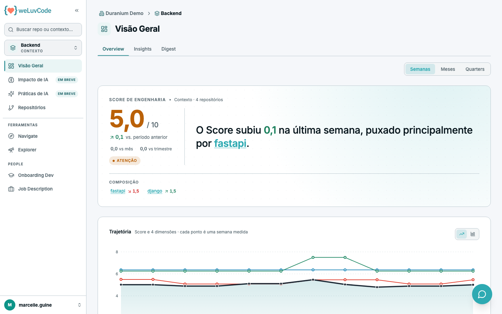
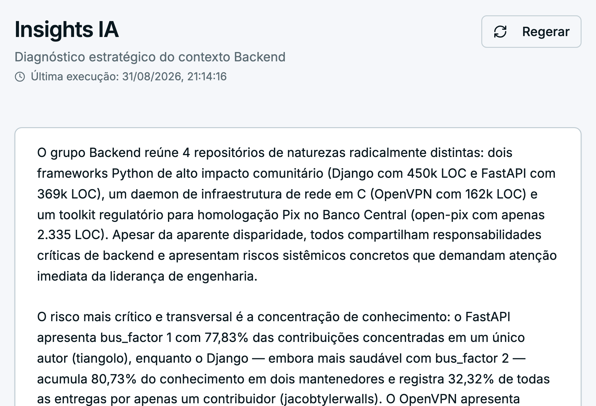
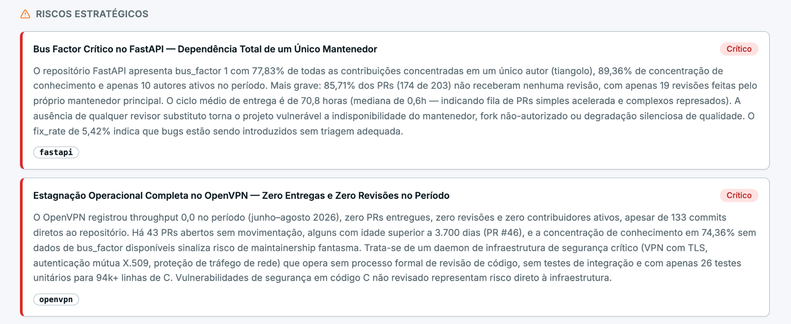
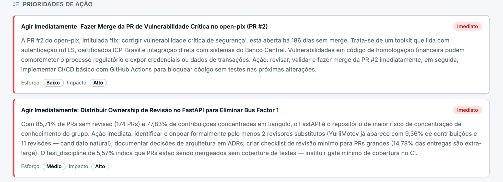
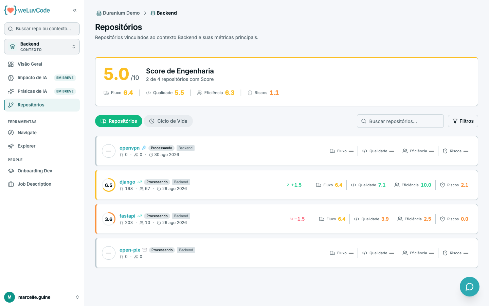
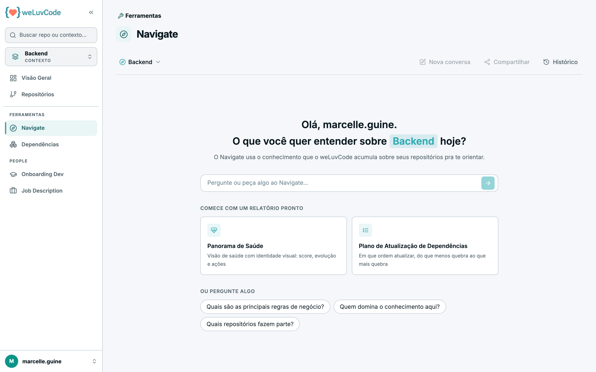

# 5. Contexto

Um contexto é um agrupamento lógico de repositórios por produto, domínio ou
squad. Clicar no nome de um contexto muda o escopo do produto inteiro: o caminho
percorrido fica visível na trilha do topo (*Workspace › Contexto*) e o seletor
da barra lateral passa a indicar o nível em que você está.

## Visão Geral do contexto

Mesma estrutura da visão do workspace — Score, variação, composição e
trajetória — restrita aos repositórios daquele contexto. A diferença está na
composição, que aqui lista repositórios em vez de contextos: é assim que se
identifica qual repositório puxou o Score do contexto.

A leitura do bloco de Score é a mesma descrita em [Workspace](m1-04-workspace.md), e
a mecânica por trás dos números está em [Métricas](m1-03-metricas.md).

Duas abas organizam o conteúdo: **Overview** e **Insights**.

## Insights IA do contexto

A aba **Insights** entrega um diagnóstico estratégico do contexto inteiro,
escrito por IA para quem responde pela área — não pelo repositório isolado. É a
leitura que a Visão Geral não dá: o Score diz onde o número está; o diagnóstico
diz o que fazer a respeito.

### Nada é gerado sozinho

A aba começa vazia, com **Nenhum insight gerado ainda**, e o botão **Gerar
Insights** no topo direito. A partir daí:

- a geração leva cerca de um minuto, e a tela mostra o estado "Gerando insights…"
  enquanto isso — pode sair da tela e voltar depois
- enquanto uma geração está em curso, outra pessoa que abra a aba vê o mesmo
  estado de processamento, e um segundo pedido não dispara uma segunda geração
- concluída, o cabeçalho passa a exibir **Última execução** com data e hora, e o
  botão vira **Regerar**
- **Regerar** sempre chama o modelo de novo: não existe resposta em cache
  devolvida no lugar. O diagnóstico anterior continua na tela até o novo ficar
  pronto
- um contexto sem nenhum repositório não oferece o botão, porque não há o que
  analisar

### O que alimenta o diagnóstico

O modelo recebe, de cada repositório do contexto, a análise de **Visão Geral** da
[documentação gerada](m1-06-repositorio.md) — o que o repositório é, como
funciona, qual a stack —, o retrato atual das métricas e as execuções recentes.
Recebe também o **briefing do contexto**, o texto cadastrado em
[Administração › Contextos](m2-03-contextos.md).

Esse é o motivo prático de manter o briefing preenchido: sem ele o diagnóstico
sai tecnicamente correto e cego quanto ao negócio. Repositório que ainda não tem
a Visão Geral analisada entra na conta como "overview indisponível", e o modelo é
instruído a desconsiderá-lo em vez de supor.

### O que a tela mostra

| Bloco | Conteúdo |
| --- | --- |
| **Resumo executivo** | no máximo três parágrafos, citando números concretos |
| **Riscos Estratégicos** | de 3 a 5 riscos sistêmicos, do mais grave para o menos: **Crítico**, **Alto**, **Médio**. Cada um traz a descrição e os repositórios afetados |
| **Prioridades de Ação** | de 4 a 6 ações, da mais urgente para a menos: **Imediato**, **Curto prazo**, **Longo prazo**. Cada uma traz **Esforço** e **Impacto**, em Baixo, Médio ou Alto |
| **Repositórios analisados** | a lista do que entrou na análise, ao pé da página |

A combinação de esforço e impacto é o que torna a lista utilizável: é ela que
separa o que rende muito por pouco trabalho do que é caro e pode esperar.

> O diagnóstico é uma leitura de um instante, com a data no cabeçalho. Depois de
> uma mudança relevante — repositório novo no contexto, análise recém-concluída,
> briefing atualizado — vale regerar antes de usar o texto em uma reunião.

## Repositórios do contexto

Mesma lista da visão do workspace, limitada ao contexto, com os recortes
**Repositórios** e **Ciclo de Vida**.

## Navigate no contexto

O assistente com o escopo restrito ao contexto: as perguntas são respondidas
considerando apenas os repositórios daquele agrupamento. O funcionamento está
descrito em [Ferramentas](m1-07-ferramentas.md).
