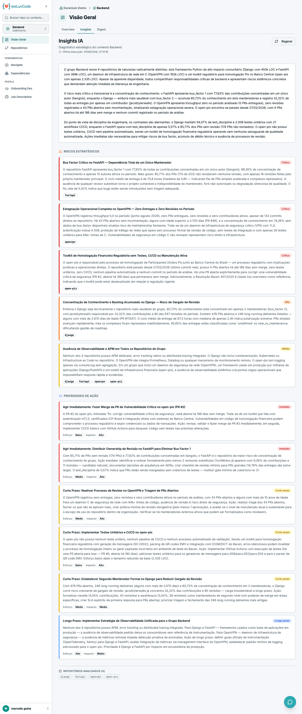
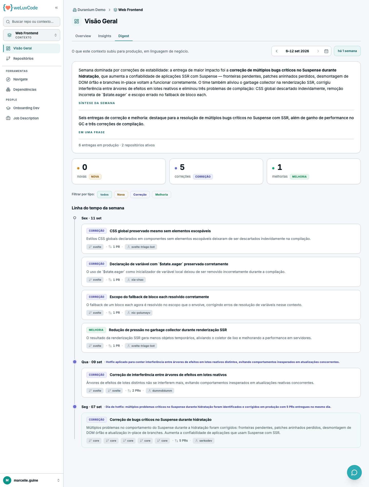

# 5. Contexto

Um contexto é um agrupamento lógico de repositórios por produto, domínio ou
squad. Clicar no nome de um contexto muda o escopo do produto inteiro: o caminho
percorrido fica visível na trilha do topo (*Workspace › Contexto*) e o seletor
da barra lateral passa a indicar o nível em que você está.

## Visão Geral do contexto

Mesma estrutura da visão do workspace — Score, variação, composição e
trajetória — restrita aos repositórios daquele contexto. A diferença está na
composição, que aqui lista repositórios em vez de contextos: é assim que se
identifica qual repositório puxou o Score do contexto.

A leitura do bloco de Score é a mesma descrita em [Workspace](m1-04-workspace.md), e
a mecânica por trás dos números está em [Métricas](m1-03-metricas.md).

Três abas organizam o conteúdo: **Overview**, **Insights** e **Digest**.

## Insights IA do contexto

A aba **Insights** entrega um diagnóstico estratégico do contexto inteiro,
escrito por IA para quem responde pela área — não pelo repositório isolado. É a
leitura que a Visão Geral não dá: o Score diz onde o número está; o diagnóstico
diz o que fazer a respeito.

### Nada é gerado sozinho

A aba começa vazia, com **Nenhum insight gerado ainda**, e o botão **Gerar
Insights** no topo direito. A partir daí:

- a geração leva cerca de um minuto, e a tela mostra o estado "Gerando insights…"
  enquanto isso — pode sair da tela e voltar depois
- enquanto uma geração está em curso, outra pessoa que abra a aba vê o mesmo
  estado de processamento, e um segundo pedido não dispara uma segunda geração
- concluída, o cabeçalho passa a exibir **Última execução** com data e hora, e o
  botão vira **Regerar**
- **Regerar** sempre chama o modelo de novo: não existe resposta em cache
  devolvida no lugar. O diagnóstico anterior continua na tela até o novo ficar
  pronto
- um contexto sem nenhum repositório não oferece o botão, porque não há o que
  analisar

### O que alimenta o diagnóstico

O modelo recebe, de cada repositório do contexto, a análise de **Visão Geral** da
[documentação gerada](m1-06-repositorio.md) — o que o repositório é, como
funciona, qual a stack —, o retrato atual das métricas e as execuções recentes.
Recebe também o **briefing do contexto**, o texto cadastrado em
[Administração › Contextos](m2-03-contextos.md).

Esse é o motivo prático de manter o briefing preenchido: sem ele o diagnóstico
sai tecnicamente correto e cego quanto ao negócio. Repositório que ainda não tem
a Visão Geral analisada entra na conta como "overview indisponível", e o modelo é
instruído a desconsiderá-lo em vez de supor.

### O que a tela mostra

| Bloco | Conteúdo |
| --- | --- |
| **Resumo executivo** | no máximo três parágrafos, citando números concretos |
| **Riscos Estratégicos** | de 3 a 5 riscos sistêmicos, do mais grave para o menos: **Crítico**, **Alto**, **Médio**. Cada um traz a descrição e os repositórios afetados |
| **Prioridades de Ação** | de 4 a 6 ações, da mais urgente para a menos: **Imediato**, **Curto prazo**, **Longo prazo**. Cada uma traz **Esforço** e **Impacto**, em Baixo, Médio ou Alto |
| **Repositórios analisados** | a lista do que entrou na análise, ao pé da página |

A combinação de esforço e impacto é o que torna a lista utilizável: é ela que
separa o que rende muito por pouco trabalho do que é caro e pode esperar.

> O diagnóstico é uma leitura de um instante, com a data no cabeçalho. Depois de
> uma mudança relevante — repositório novo no contexto, análise recém-concluída,
> briefing atualizado — vale regerar antes de usar o texto em uma reunião.

## Digest do contexto

A aba **Digest** responde uma pergunta que nenhuma outra tela do produto responde:
*o que este contexto subiu para produção nesta semana* — em linguagem de negócio,
não em linguagem de commit.

Vale a comparação com as abas vizinhas. A Visão Geral e as
[Métricas](m1-03-metricas.md) falam de processo: ritmo, qualidade, risco. Os
Insights falam de diagnóstico: o que está errado e o que fazer. O Digest fala de
**entrega**: o que ficou pronto. É a aba para levar a uma conversa com quem não
lê código.

O material de origem são os PRs que chegaram à produção nos repositórios do
contexto; a IA os agrupa em entregas e as descreve. Um PR não é uma entrega:
cinco PRs de um mesmo conserto aparecem como uma linha só, com a contagem ao
lado.

> A aba depende da feature flag `digest`. Com ela desligada, a aba não aparece —
> e um link `?tab=digest` cai silenciosamente na Overview, sem mensagem de erro.

### A semana

O controle no topo direito navega entre semanas: setas para a anterior e a
seguinte, um seletor de calendário para escolher uma semana específica, e ao lado
o rótulo relativo — *esta semana*, *há 1 semana*, *há 3 semanas*. A aba sempre
abre na semana mais recente.

A semana escolhida **não fica na URL**: sair da aba e voltar reabre na mais
recente. A exceção é o link que chega de fora — o card semanal enviado ao
comunicador aponta para a semana que ele reporta, e abri-lo dias depois cai
naquela semana, não na atual. Link com semana inválida ou fora do alcance cai na
mais recente sem erro.

### Síntese da semana

O primeiro bloco traz o parágrafo de abertura, com a **entrega de maior impacto
em negrito** — semana sem destaque claro simplesmente não tem o trecho em
negrito. Abaixo dele, separado, o bloco **Em uma frase**, que é o resumo curto
para colar em uma mensagem. Fecha com o rodapé: *N entregas em produção · N
repositórios ativos*.

### Os três tipos

As entregas são classificadas em três tipos, e cada um tem seu cartão com a
contagem da semana:

| Tipo | O que é |
| --- | --- |
| **Nova** | funcionalidade que não existia |
| **Correção** | conserto de comportamento |
| **Melhoria** | o que já existia, agora melhor |

**Cada cartão é também um filtro.** Clicar filtra a linha do tempo por aquele
tipo; clicar no cartão ativo volta para *todos*. Cartão com contagem zero
continua clicável — leva ao estado vazio, que é uma resposta honesta e não um
beco. Os mesmos filtros aparecem como chips logo abaixo, e o filtro escolhido
**sobrevive à troca de semana**: é o que permite percorrer várias semanas olhando
só as correções, por exemplo.

### Linha do tempo da semana

As entregas ficam agrupadas por dia, do mais recente para o mais antigo. Alguns
dias trazem uma nota ao lado da data, quando o dia tem uma história própria — por
exemplo, um dia de hotfix com vários PRs do mesmo problema.

Cada entrega mostra o tipo, o título em linguagem de negócio, uma descrição curta
e, no rodapé:

- **um chip por PR**, com o nome do repositório, que abre aquele PR no GitHub em
  uma nova aba — uma entrega com cinco PRs mostra cinco chips, cada um apontando
  para o seu
- a **contagem de PRs** da entrega
- os **autores**, cujo chip leva ao perfil no GitHub

Quando a semana tem mais entregas do que cabe de uma vez, **ver mais entregas**
carrega o restante, com o contador de quantas já estão na tela.

### Os quatro estados

| Estado | O que significa |
| --- | --- |
| **Gerando o digest desta semana** | a IA está agrupando os PRs em entregas; costuma levar menos de um minuto, e a tela se atualiza sozinha quando termina |
| **Semana sem entregas em produção** | nenhum PR do contexto chegou à produção naquela semana |
| **Conecte repositórios a este contexto** | o contexto não tem repositório conectado, então não há o que resumir |
| **Não foi possível gerar o digest** | a análise da semana falhou; o botão **Tentar novamente** refaz |

### O mesmo digest, entregue no comunicador

Este é o mesmo conteúdo que o produto envia semanalmente ao comunicador do time,
quando o contexto está matriculado em
[Administração › Notificações](m2-07-notificacoes.md). Ler aqui e receber lá são
duas portas para a mesma coisa: a tela não depende da matrícula, e o envio depende
de uma flag própria.

## Repositórios do contexto

Mesma lista da visão do workspace, limitada ao contexto, com os recortes
**Repositórios** e **Ciclo de Vida**.

## Navigate no contexto

O assistente com o escopo restrito ao contexto: as perguntas são respondidas
considerando apenas os repositórios daquele agrupamento. O funcionamento está
descrito em [Ferramentas](m1-07-ferramentas.md).
