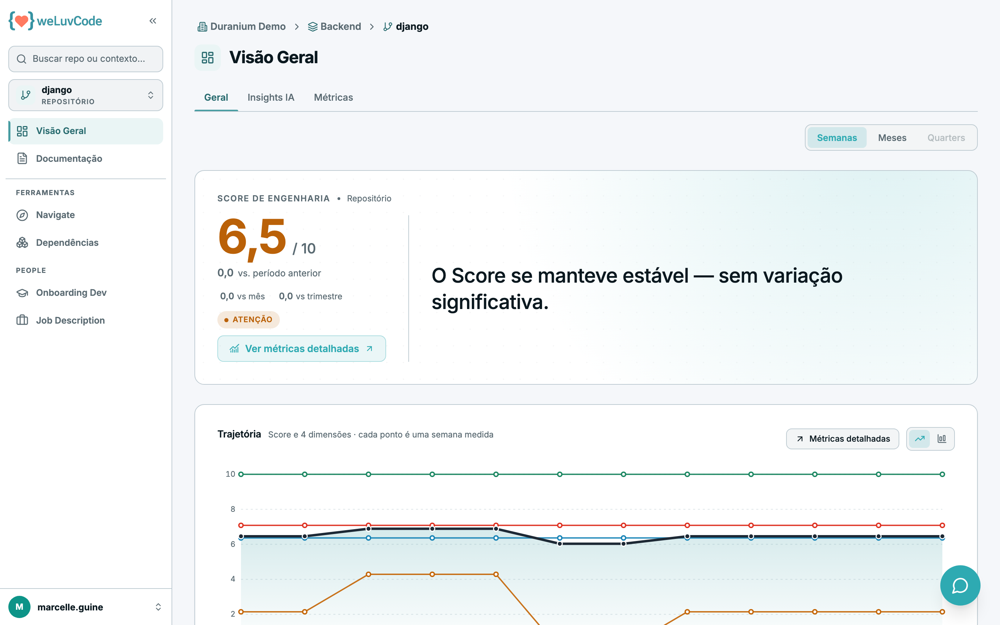
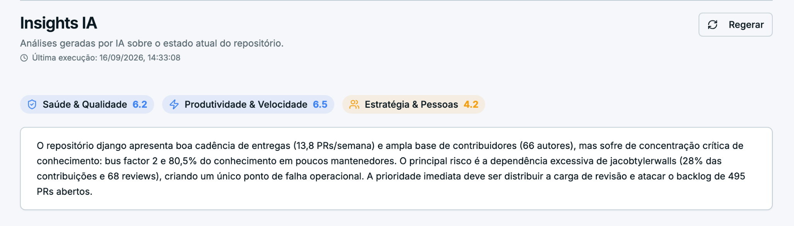
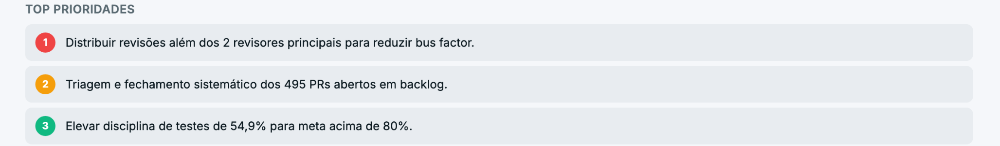
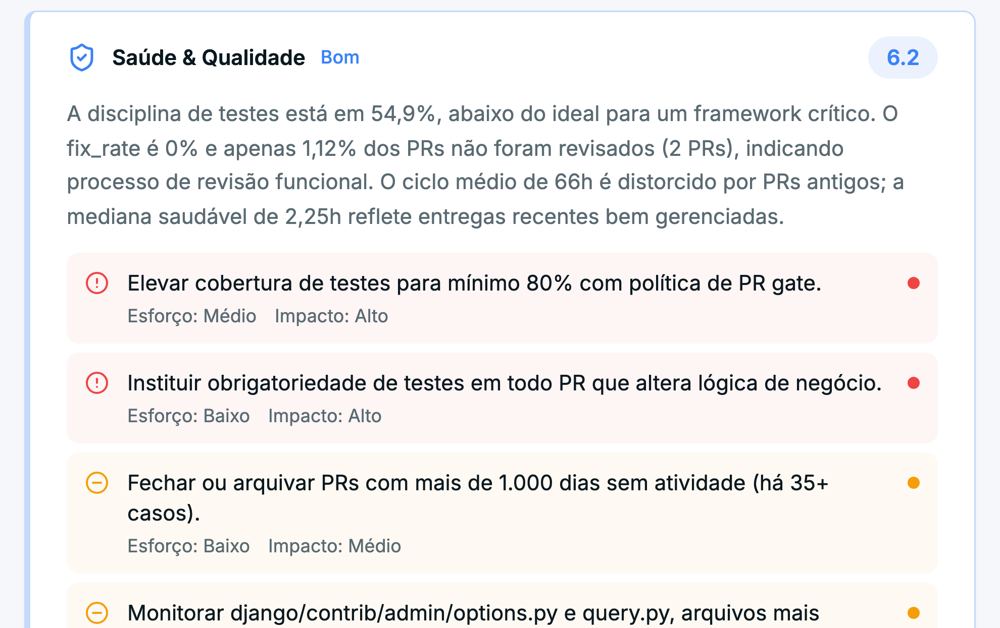
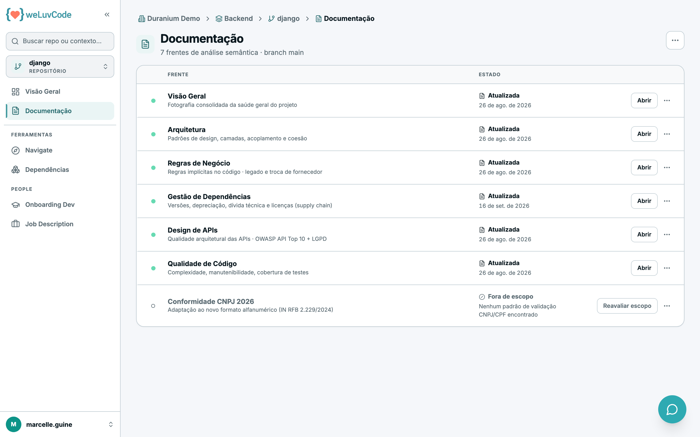

# 6. Repositório

O repositório é o nível mais profundo da navegação, e é onde o Score de fato é
calculado — os níveis acima agregam. A trilha do topo mostra o caminho completo
(*Workspace › Contexto › Repositório*).

A barra lateral, neste nível, traz **Visão Geral** e **Documentação**.

## Visão Geral do repositório

Score do repositório, variação e trajetória. A composição, aqui, lista as quatro
dimensões em vez de repositórios — é o nível em que se vê qual dimensão está
puxando o Score.

A Visão Geral do repositório tem três abas: **Geral**, **Insights IA** e
**Métricas**.

O botão **Ver métricas detalhadas** abre a aba **Métricas**, onde cada indicador
aparece com o valor medido e a faixa em que se enquadra. Essa tela está
explicada em [Métricas](m1-03-metricas.md).

## Insights IA do repositório

A aba **Insights IA** transforma os números do repositório em leitura e
recomendação. É o equivalente, um nível abaixo, do
[diagnóstico do contexto](m1-05-contexto.md): lá a pergunta é estratégica, aqui é
operacional — o que este repositório precisa que seja feito.

A mecânica de geração é a mesma do contexto: a aba começa vazia, **Gerar
Insights** dispara a análise, a geração leva cerca de um minuto, o cabeçalho
passa a mostrar **Última execução** e o botão vira **Regerar**. Regerar sempre
chama o modelo de novo, e o diagnóstico anterior fica na tela até o novo ficar
pronto.

O que alimenta a análise aqui são as métricas de processo do repositório e as
execuções recentes, somadas ao contexto da empresa — nome, segmento e descrição
cadastrados em [Administração › Geral](m2-01-geral.md). É por isso que aquele
cadastro não é burocracia: ele muda o tom da recomendação para o setor em que a
organização opera.

### As três dimensões do diagnóstico

O resultado vem organizado em três dimensões, cada uma com nota de 1 a 10:

| Dimensão | O que avalia |
| --- | --- |
| **Saúde & Qualidade** | estado atual da qualidade, métricas-chave e o principal gap |
| **Produtividade & Velocidade** | velocidade de entrega, gargalos e vazão |
| **Estratégia & Pessoas** | distribuição de carga, risco de concentração e oportunidades de IA |

> **Estas três dimensões não são as quatro dimensões do Score.** O Score é
> calculado a partir de indicadores medidos, com pesos fixos, e está descrito em
> [Métricas](m1-03-metricas.md). As notas desta aba são uma leitura do modelo
> sobre aqueles mesmos dados, em outro recorte. Quando as duas divergirem, o
> número que vale para acompanhamento é o do Score.

Cada nota recebe uma palavra, pela mesma régua: **Excelente** de 8 para cima,
**Bom** a partir de 6, **Atenção** a partir de 4 e **Crítico** abaixo de 4.

### O que a tela mostra

| Bloco | Conteúdo |
| --- | --- |
| **Notas por dimensão** | as três dimensões e suas notas, no topo, para leitura imediata |
| **Resumo executivo** | o parágrafo de abertura, citando números dos dados |
| **Top Prioridades** | exatamente três ações, numeradas de 1 a 3 |
| **Uma seção por dimensão** | nota, situação, resumo de até três frases e de 3 a 5 recomendações |

Cada recomendação é uma frase curta e vem com **Esforço** e **Impacto** — Baixo,
Médio ou Alto — e um marcador de prioridade: vermelho para alta, âmbar para
média, verde para baixa. O par esforço/impacto é o que permite montar uma fila de
trabalho sem ler tudo.

Enquanto o repositório não tiver um diagnóstico gerado, a aba mostra o estado de
espera em vez de números.

## Documentação gerada

É onde o WLC entrega a leitura semântica do código. A plataforma analisa o
repositório em **sete frentes**, cada uma com estado próprio, indicando a branch
analisada.

| Frente | O que cobre |
| --- | --- |
| Visão Geral | fotografia consolidada da saúde do projeto |
| Arquitetura | padrões de design, camadas, acoplamento e coesão |
| Regras de Negócio | regras implícitas no código |
| Gestão de Dependências | versões, depreciação, dívida técnica e licenças |
| Design de APIs | qualidade arquitetural das APIs |
| Métricas de Código | complexidade, manutenibilidade e cobertura de testes |
| Conformidade CNPJ 2026 | adaptação ao novo formato alfanumérico |

> **Métricas de Código** é o nome novo da frente que até aqui se chamava
> *Qualidade de Código*. A troca está em andamento no produto, então algumas
> telas ainda exibem o nome antigo.

Cada frente exibe um de sete estados, e o estado determina a ação disponível na
linha:

| Estado | O que significa | Ação na linha |
| --- | --- | --- |
| **Atualizada** | a análise foi concluída, com a data da última atualização | **Abrir** mostra o documento |
| **Processando** | há uma análise em curso. Se a frente já tinha documento, ele continua disponível; se é a primeira análise, ainda não há o que abrir | **Abrir versão anterior**, quando existe |
| **Falha na última análise** | a última tentativa falhou, mas o documento anterior foi preservado | **Abrir versão anterior** |
| **Falha** | a tentativa falhou e nenhum documento foi gerado | **Gerar novamente** |
| **Cancelada** | a execução foi interrompida antes de terminar; o documento anterior, quando havia, continua servido | **Abrir versão anterior** ou **Gerar novamente** |
| **Fora de escopo** | a frente não se aplica àquele repositório, e o produto diz por quê (por exemplo, nenhum endpoint de API detectado) | **Reavaliar escopo** força uma nova verificação |
| **Pendente** | a frente nunca foi gerada neste repositório | **Gerar agora** dispara a primeira análise |

Dois desses estados merecem leitura atenta. **Fora de escopo** é deliberado: em
vez de entregar um documento vazio, o produto explica a ausência. E a distinção
entre **Falha na última análise** e **Falha** diz se ainda há material para ler —
no primeiro caso o documento anterior continua acessível, no segundo não existe
documento nenhum.

### O que define "fora de escopo"

A decisão é automática e acontece **antes** da análise rodar. O motor inspeciona
o repositório e produz artefatos de detecção — inventário de arquivos,
tecnologias, dependências declaradas, registro de APIs — e cada frente tem um
critério objetivo sobre esses artefatos.

Vale registrar como a decisão **não** é tomada: ela não depende de julgamento do
modelo de IA. Os critérios usam apenas sinais calculados a partir do código, o
que evita que uma leitura equivocada do modelo tire uma análise de escopo.

Primeiro há uma regra geral. **Repositório pequeno** — menos de 100 linhas de
código *e* menos de 5 arquivos — coloca todas as frentes fora de escopo, exceto a
Visão Geral. As duas condições precisam ser verdadeiras ao mesmo tempo.

Depois, cada frente tem seu próprio critério:

| Frente | Entra em escopo quando | Mensagem quando não entra |
| --- | --- | --- |
| **Visão Geral** | sempre; é a única frente que a regra de repositório pequeno não afeta | — |
| **Arquitetura** | o repositório tem mais de 5 arquivos e contém arquivos de código-fonte | "Repositório não possui estrutura suficiente para análise de arquitetura" |
| **Regras de Negócio** | o repositório tem mais de 100 linhas e contém arquivos de código-fonte | "Repositório possui código insuficiente para análise de negócios" |
| **Métricas de Código** | há pelo menos alguma linha de código e arquivos de código-fonte | "Nenhum arquivo de código-fonte encontrado" |
| **Gestão de Dependências** | há dependências declaradas em algum gerenciador de pacotes | "Nenhuma dependência detectada" |
| **Design de APIs** | há endpoints detectados, ou arquivos de especificação de API (OpenAPI, WSDL, GraphQL, gRPC) | "Nenhum endpoint de API detectado" |
| **Conformidade CNPJ 2026** | o repositório declara alguma biblioteca conhecida de validação de CPF/CNPJ | "Nenhum padrão de validação CNPJ/CPF encontrado" |

Dois detalhes que evitam falso negativo:

- **"Arquivo de código-fonte" exclui markdown, formatos de configuração e
  arquivos de dados.** Um repositório só com YAML e README não passa nos
  critérios que exigem código, e é por isso que a mensagem de Métricas de Código
  menciona repositórios que contêm apenas configurações ou scripts simples.
- **Design de APIs não exige endpoints implementados.** Um repositório que só
  publica contratos — arquivos `.wsdl`, `.proto` ou especificações OpenAPI — entra
  em escopo mesmo sem código de API.

Quando os artefatos de detecção não estão disponíveis, o motor assume que a
análise **se aplica** em vez de descartá-la. O comportamento é conservador na
direção de analisar demais, não de menos.

É por isso que **Reavaliar escopo** existe: o critério é avaliado sobre o estado
do repositório naquele momento. Um repositório que ganhou seu primeiro endpoint,
ou passou a declarar dependências, muda de situação — e a reavaliação é o que
detecta isso.

### Como a documentação é atualizada

As análises não são geradas uma única vez: elas acompanham a evolução do código.
Há dois caminhos.

**Automaticamente, pela esteira de CI/CD.** Quando o repositório tem a integração
configurada, cada execução do pipeline dispara uma nova análise, e a documentação
reflete o estado atual do código sem intervenção. A conexão é feita com uma chave
de API, criada em [Administração › API Keys](m2-00-visao-admin.md) — é para isso
que aquelas chaves existem.

**Manualmente, por esta tela.** O menu de ações de cada frente, no fim da linha,
oferece **Gerar novamente**, que reprocessa apenas aquela análise. Para
reprocessar tudo de uma vez, o menu no topo direito da tela traz **Gerar todas
novamente**, que pede confirmação antes de disparar — a análise de todas as
frentes leva alguns minutos e consome recursos do motor.

Os mesmos menus permitem exportar o resultado: **Baixar PDF** e **Baixar
Markdown** por frente, ou **Baixar tudo em PDF** e **Baixar tudo em Markdown**
para o conjunto.

Frentes que produzem diagramas oferecem mais uma saída. Com o documento aberto, o
menu de ações traz **Baixar fontes dos diagramas (Mermaid)**, que salva um único
arquivo Markdown com o código-fonte de todos os diagramas daquela frente. É o que
permite reaproveitá-los em outra ferramenta — uma wiki, um slide, um documento de
arquitetura — em vez de recortar a imagem da tela. A opção só aparece nas frentes
que têm diagrama.

Frentes marcadas como *Fora de escopo* não têm a opção de gerar novamente, e sim
**Reavaliar escopo**: em vez de reprocessar uma análise que não se aplica, o
produto verifica de novo se ela passou a se aplicar — por exemplo, se o
repositório ganhou endpoints de API desde a última verificação.

> **Esta frente está em evolução.** A análise semântica que produz esses
> documentos está passando por uma reformulação ampla, que abrange desde a coleta
> dos dados até o processamento e a forma de apresentá-los. Por isso, neste
> momento, algumas análises aparecem com layout e nível de detalhe diferentes das
> demais. A diferença é temporária e será uniformizada conforme as frentes forem
> migradas para o novo formato.
