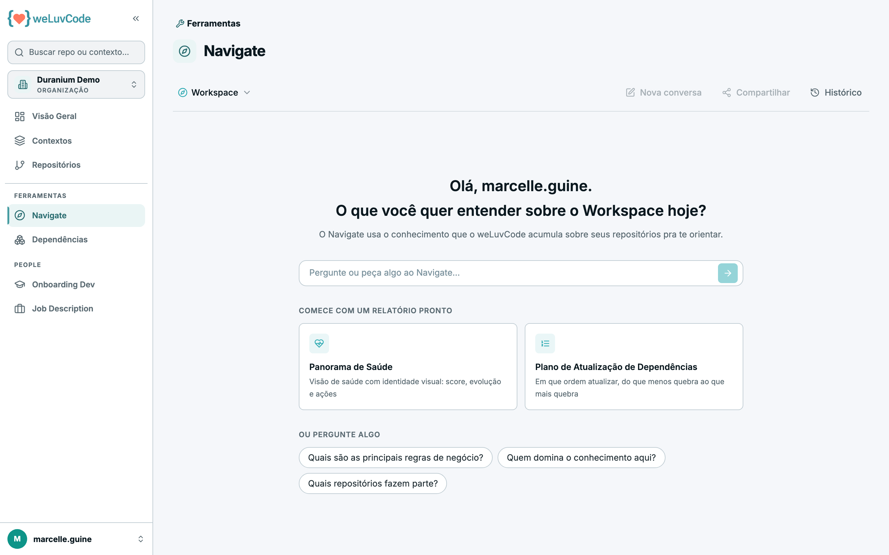
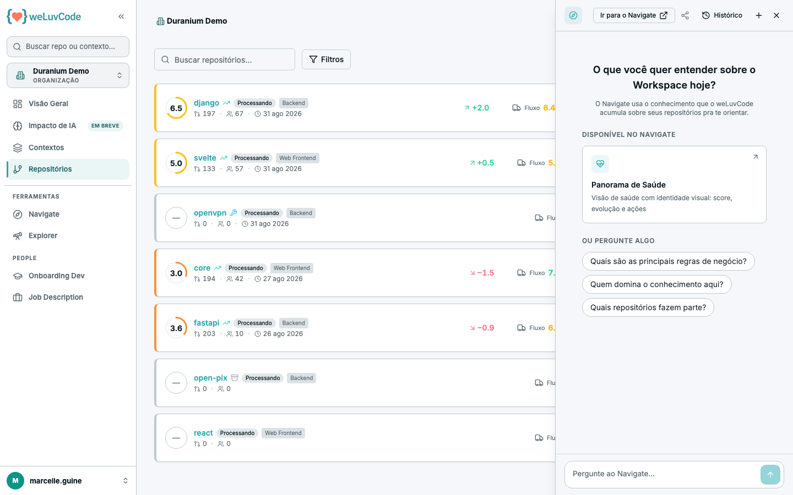
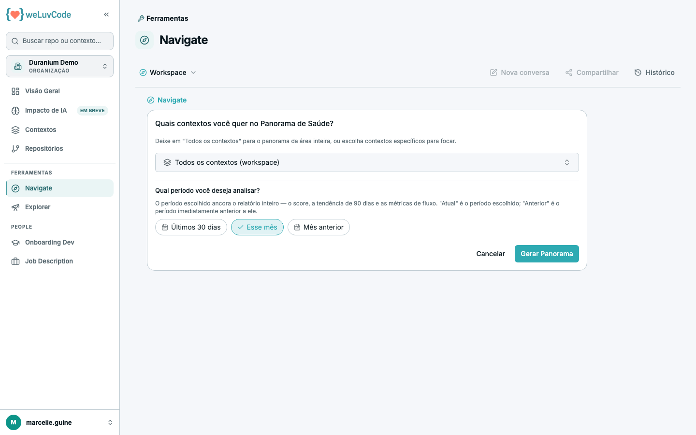
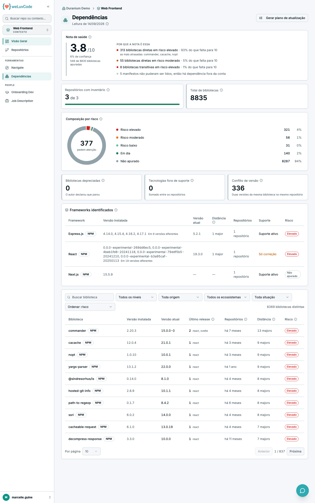

# 7. Ferramentas

## Navigate

Assistente que responde perguntas usando o conhecimento que o WLC acumulou sobre
os repositórios — tanto a documentação gerada pelas análises semânticas quanto as
métricas de processo.

### Onde acessar

Há dois caminhos, e eles compartilham o mesmo histórico de conversas:

- **Pelo menu lateral**, em Ferramentas › Navigate, que abre a tela cheia
- **Pelo botão flutuante**, o ícone de conversa no canto inferior direito, que
  está presente em **todas as telas do produto** e abre um painel lateral sem
  tirar você de onde está

O painel é a versão compacta: serve para uma pergunta rápida sobre a tela que
você está vendo. Ele traz **Ir para o Navigate**, que transfere a conversa para a
tela cheia quando o assunto se aprofunda.

### Escopo da conversa

O seletor no canto superior esquerdo define sobre o que o Navigate responde:

- **Workspace** — o workspace inteiro, com todos os seus repositórios
- **Um contexto específico** — apenas os repositórios daquele agrupamento

Ao abrir o painel flutuante, o escopo vem da tela em que você está. O escopo não
pode ser trocado no meio de uma resposta: é preciso esperar a resposta corrente
terminar.

> O que cada pessoa enxerga depende das permissões. Com a filtragem por usuário
> ativa, perfis de desenvolvedor e visualizador só recebem respostas sobre os
> repositórios aos quais têm acesso pelos seus
> [grupos](m2-00-visao-admin.md).

### Os três botões

**Nova conversa** — descarta o contexto acumulado e começa do zero. Útil quando o
assunto muda: sem isso, o Navigate segue considerando as perguntas anteriores.

**Compartilhar** — gera um link para a conversa. O acesso é restrito: apenas
pessoas **do mesmo workspace** e **com permissão sobre os repositórios tratados
na conversa** conseguem abrir. Links de outro workspace são recusados, e quem
não tem acesso aos repositórios recebe orientação para pedir liberação ao
administrador. Quem abre um link compartilhado vê a conversa marcada como
*Compartilhada por* quem a gerou.

**Histórico** — lista as conversas anteriores, com a data relativa de cada uma
("Há 3 dias") e o escopo em que foi feita, para retomar de onde parou.

### Panorama de Saúde

É um dos dois relatórios prontos oferecidos em **Comece com um relatório
pronto** — o outro é o **Plano de Atualização de Dependências**, descrito mais
adiante. Ele monta uma visão consolidada de saúde da engenharia —
score, evolução no período e ações sugeridas — com formatação própria, em vez de
uma resposta em texto corrido.

O Panorama é sempre construído **sobre contextos**. Ao acioná-lo, o produto
pergunta duas coisas:

1. **Quais contextos entram** — um, vários, ou "Todos os contextos (workspace)".
   Quando muitos contextos são selecionados, todos entram no score consolidado,
   mas a tabela detalha os principais e agrupa o restante em "Demais".
2. **Qual o período base** — Últimos 30 dias, Esse mês ou Mês anterior.

O período escolhido ancora o relatório inteiro: o score, a tendência de 90 dias e
as métricas de fluxo. Nas comparações, "Atual" é o período escolhido e "Anterior"
é o período imediatamente anterior a ele.

No painel flutuante o Panorama aparece como **Disponível no Navigate**: clicar
leva à tela cheia, onde a seleção de contextos e período acontece.

### O que perguntar

O produto oferece três atalhos abaixo do campo de pergunta:

- Quais são as principais regras de negócio?
- Quem domina o conhecimento aqui?
- Quais repositórios fazem parte?

São pontos de partida, não um cardápio fechado. Como o Navigate se apoia na
documentação gerada pelas análises e nas métricas de processo, as perguntas que
mais rendem são as que aproveitam esse cruzamento:

**Para entrar em um código desconhecido**

- O que este repositório faz e como está organizado?
- Quais são as regras de negócio implícitas neste módulo?
- Que decisões de arquitetura explicam a estrutura atual?
- Por onde começar para mexer nesta parte do sistema com segurança?

**Para entender um número do painel**

- Por que a Qualidade da Engenharia caiu no último período?
- O que está puxando o Bus Factor para baixo neste repositório?
- Quais repositórios têm o maior risco de continuidade hoje?
- O que mudou nas últimas semanas que explica a variação do Score?

**Para decidir onde agir**

- Quais repositórios deveriam receber atenção nesta semana?
- Onde a revisão de código está concentrada em poucas pessoas?
- Que dependências estão desatualizadas ou representam risco?
- Quais repositórios estão em estágio de legado mas ainda são críticos?

**Para preparar uma conversa ou um documento**

- Resuma a saúde desta área para uma reunião de gestão.
- Quem procurar sobre este módulo?
- Que pontos de conformidade merecem atenção neste repositório?

## Dependências

Inventário das bibliotecas de terceiros usadas pelo código, com o quanto cada
uma está atrasada em relação à versão publicada. Fica em Ferramentas ›
Dependências, ao lado do Navigate.

É uma ferramenta, não uma aba: o assunto é próprio, e a pessoa chega aqui de
propósito — não de passagem, olhando a saúde do repositório.

### Três escopos, a mesma tela

Como o Navigate, Dependências é contextual. O escopo vem de onde você está:

| Escopo | Pergunta que responde |
| --- | --- |
| **Workspace** | quais bibliotecas pedem atenção no parque inteiro |
| **Contexto** | as mesmas, restritas aos repositórios daquele agrupamento |
| **Repositório** | o que está instalado aqui |

A diferença não é só de filtro. No repositório, cada linha da tabela é uma
instalação. Nos escopos agregados, cada linha é uma **biblioteca distinta**, com
a contagem de em quantos repositórios ela aparece — que é a informação que muda a
conversa nesse nível: a mesma biblioteca desatualizada em quarenta repositórios é
uma decisão de plataforma; em um, é uma tarefa.

Abaixo do título fica a **data da leitura**, que qualifica todos os números da
tela. Nos escopos agregados, essa data é a leitura **mais antiga** do conjunto,
não a mais recente: cada repositório é lido no seu próprio momento, e é a leitura
mais velha que limita a confiança no total.

> A tela depende da coleta de dependências estar habilitada para o workspace.
> Sem isso, o item nem aparece no menu.

### Nota de saúde e confiança

O bloco principal traz dois números, nunca um só.

A **nota**, de 0 a 10, diz o quanto está atrasado aquilo que foi possível medir.
Ela pesa cada biblioteca pelo risco — risco elevado pesa 3, moderado 1, baixo
0,25, em dia 0 — e uma dependência **direta pesa o dobro** de uma transitiva,
porque é a que o time escolheu e pode trocar.

A **confiança**, em porcentagem, diz quanto do parque essa nota representa. Existe
porque uma nota 10 sobre uma única biblioteca apurada é uma mentira sem ela.

Três regras completam a leitura:

- **O que não foi apurado fica fora da conta.** Não medir não é estar bem: o não
  apurado aparece na confiança, nunca na nota.
- **Abaixo de 50% de confiança a nota aparece sem classificação.** O número é
  mostrado, a palavra é omitida.
- **Tecnologia fora de suporte segura a nota em 5**, por melhor que esteja o resto.
  A linguagem ou o banco sustentam tudo o que está em cima deles; nenhuma
  arrumação de bibliotecas compensa isso.

Ao lado da nota, **Por que a nota é essa** lista o que a está puxando — quantas
diretas e quantas transitivas em cada nível, quanto cada grupo representa do que
falta para 10, e os nomes das mais atrasadas. Quando nada está atrasado, a tela
diz isso em vez de ficar em branco.

### Cobertura

Nos escopos agregados, **Repositórios com inventário** mostra quantos
repositórios já foram lidos, de quantos existem. É a fração que impede o resto da
tela de mentir: enquanto a coleta não passou por todos, os números abaixo são a
soma dos lidos — não do parque inteiro. Repositório sem inventário não é
repositório sem dependências.

### Os cinco níveis de risco

| Nível | O que significa |
| --- | --- |
| **Elevado** | está uma versão *major* atrás, ou o autor declarou que parou de manter |
| **Moderado** | está uma versão *minor* atrás: ganhou funcionalidade nova, sem quebra esperada |
| **Baixo** | está só uma correção atrás; atualizar tende a ser troca de número |
| **Em dia** | está na versão mais recente publicada |
| **Não apurado** | não foi possível dizer — código do próprio cliente, pacote que o registro não conhece, ou ecossistema sem fonte |

**Não apurado não quer dizer que está tudo bem.** É a ausência de resposta, e por
isso fica fora da escala e fora da nota.

A **distância** é medida pela posição do número que mudou: de 1.x para 2.x é
major, de 1.2 para 1.5 é minor, de 1.2.3 para 1.2.9 é correção. Há uma exceção
que vale conhecer: quando a versão começa com zero (0.x), a própria especificação
diz que qualquer coisa pode mudar a qualquer momento, então tudo conta um grau
acima — de 0.1 para 0.2 é tratado como major.

Biblioteca **depreciada** é sempre risco elevado, independentemente da distância:
o autor parou, e continuar na última versão publicada não ajuda, porque não
haverá próxima.

### Os cartões

Abaixo da nota, a composição por risco aparece em um gráfico, acompanhada de
cartões que respondem perguntas específicas:

| Cartão | O que conta |
| --- | --- |
| **Total de bibliotecas** | todas as instaladas; nos escopos agregados a mesma biblioteca em dez repositórios conta dez vezes aqui e uma vez na tabela |
| **Bibliotecas depreciadas** | aquelas cujo autor declarou que parou |
| **Tecnologias fora de suporte** | linguagem, servidor ou banco cujo fabricante encerrou o ciclo — não saem mais correções, nem de segurança |
| **Conflito de versão** | bibliotecas instaladas em mais de uma versão dentro do mesmo repositório |

Os cartões são clicáveis: clicar filtra a tabela abaixo, clicar de novo desfaz.

Sobre conflito de versão, uma ressalva: só ecossistemas que empilham versões
chegam a ter esse número — o npm é o caso comum. Onde a resolução é de uma versão
por projeto, zero quer dizer "não se aplica", e não "está limpo".

**Frameworks identificados** agrupa pelo nome do framework, não pelo pacote: as
dezenas de extensões de um mesmo framework contam como um. A lista é curada, então
um framework ausente pode simplesmente não estar nela.

### A tabela

A tabela lista as bibliotecas com versão instalada, versão atual, data do último
release, distância e risco — e, nos escopos agregados, em quantos repositórios
cada uma aparece.

A coluna **Último release** responde o que a distância não responde: uma
biblioteca sem versão nova pode estar pronta ou pode estar abandonada, e nos dois
casos a distância é zero. A data separa os dois casos — e não é uma nota: anos sem
release são normais em uma biblioteca pequena e terminada, e são alerta em uma que
ainda tem trabalho em aberto.

Os filtros acima da tabela recortam por busca de nome, nível de risco, origem
(as que o time escolheu, as que vieram junto), situação (só as depreciadas, só os
frameworks) e ecossistema. A ordenação padrão é por risco; nos escopos agregados
há também **nº de repositórios**, que é a ordenação que responde "onde isso está
espalhado".

No escopo de repositório, uma segunda tabela, **Tecnologias declaradas**, trata do
que não é biblioteca: a linguagem, o servidor, o banco. Ela mostra o produto, o
ciclo declarado, o último patch, a última versão suportada, onde a declaração foi
encontrada e a situação do suporte — *Suporte ativo*, *Só correção* ou *Fora de
suporte*. Fica vazia quando o projeto não declara qual versão usa, o que não é o
mesmo que estar tudo em dia.

### Gerar plano de atualização

O botão no topo direito não gera nada sozinho: ele abre o **Navigate** com este
escopo já selecionado e o relatório **Plano de Atualização de Dependências**
escolhido, e espera a sua confirmação lá. É o mesmo desenho do Panorama de Saúde
— a ideia é permitir ampliar o escopo antes de gastar a chamada.

O plano responde em que ordem atualizar, do que menos quebra ao que mais quebra.

Quando não há inventário no escopo, o botão fica desabilitado e diz por quê: sem
bibliotecas lidas, o relatório só teria como recomendar que se rode uma análise.

### Quando a tela está vazia

O inventário é coletado junto com a análise de cada repositório. Uma tela vazia
significa que a análise ainda não passou por ali — e a própria tela diz o que
fazer: se depois da próxima análise continuar vazia, é porque a coleta de
dependências ainda não está habilitada para o workspace.

Vazio e erro são estados diferentes, e a tela os separa: "ainda não há inventário"
quer dizer que não existe nada a mostrar; "não foi possível carregar" quer dizer
que não conseguimos consultar — o que não é o mesmo que não haver bibliotecas.
