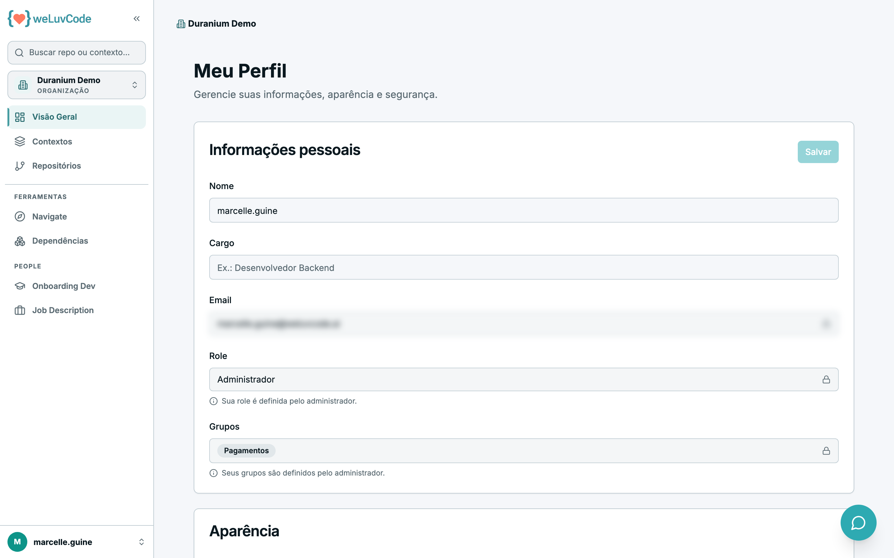

# 9. Perfil e conta

Em **Meu Perfil** você edita seus dados e a aparência do produto.

Campos editáveis:

- **Nome**
- **Cargo**

Campos apenas de leitura, sinalizados com um cadeado:

- **Email**
- **Role** — o perfil de acesso, definido pelo administrador
- **Grupos** — também definidos pelo administrador; são eles que determinam quais
  repositórios você enxerga, qualquer que seja o seu perfil (ver
  [Grupos de Usuários](m2-06-grupos.md))

O produto explica cada bloqueio na própria tela, para deixar claro que a mudança
existe, mas passa pela administração.

Abaixo fica a seção **Aparência**, com as preferências visuais.

> No print, o e-mail está borrado por ser dado pessoal.
