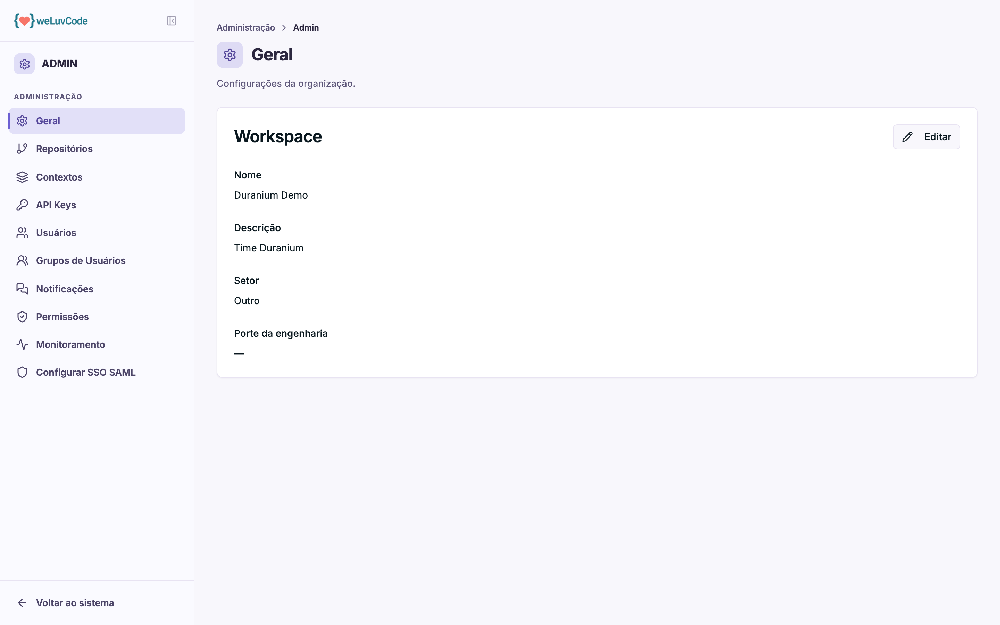

# Geral

Os dados cadastrais do workspace — o que o produto usa para se referir a ele e
para calibrar comparações.

## Os campos

| Campo | Para que serve |
| --- | --- |
| **Nome** | identifica o workspace no cabeçalho e na barra lateral |
| **Descrição** | texto livre sobre o que o workspace faz |
| **Setor** | segmento de atuação |
| **Porte da engenharia** | tamanho do time técnico |

Setor e porte não são decorativos: eles dão à plataforma uma referência do tipo
de operação, o que ajuda a contextualizar análises e relatórios gerados por IA.

## Como editar

O botão **Editar**, no canto do cartão, libera os campos para alteração. O nome
alterado passa a valer imediatamente em toda a interface.
