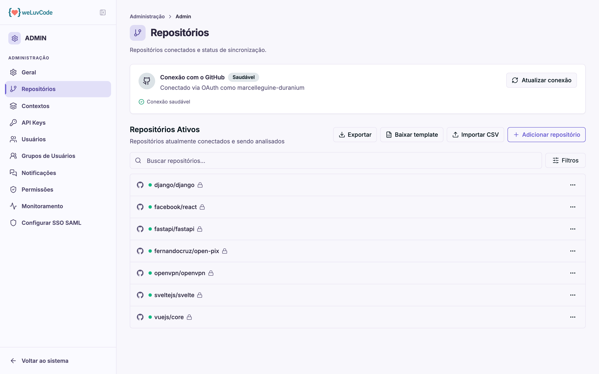
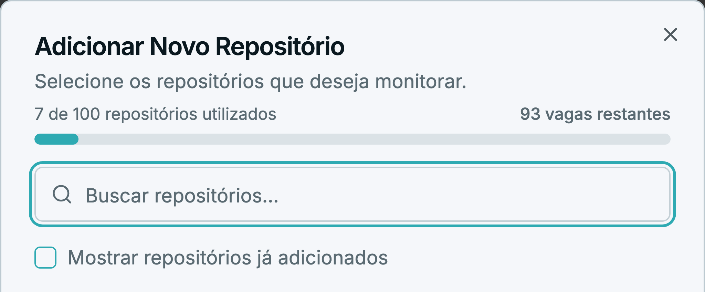
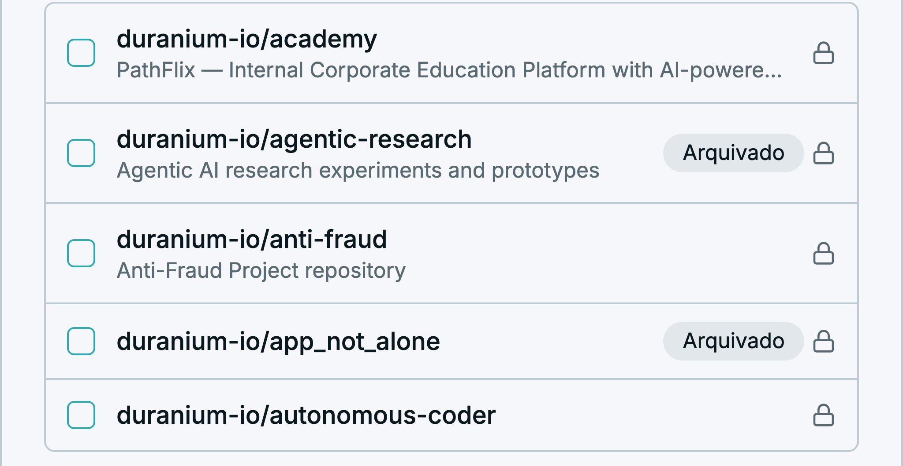

# Repositórios

Onde os repositórios são conectados ao WLC. Nada é analisado antes de passar por
aqui.

## A conexão com o GitHub

O bloco superior mostra o estado da integração: o método (OAuth), a conta usada e
um indicador de saúde. **Atualizar conexão** refaz a autorização — necessário
quando as permissões concedidas mudam ou expiram.

Se a conexão estiver sem alguma permissão obrigatória, o produto avisa nesse
bloco e explica quais faltam. Sem elas, as análises não rodam.

## Adicionar repositórios

**Adicionar repositório** abre a lista de repositórios disponíveis na conta
conectada, com busca por nome. O topo do diálogo informa a **cota do plano** —
quantos repositórios já estão em uso e quantas vagas restam — em número e em
barra de progresso.

Repositórios já adicionados ficam ocultos por padrão; a caixa **Mostrar
repositórios já adicionados** os exibe. A lista mostra a descrição de cada
repositório e marca os **arquivados**, para que não sejam incluídos por engano.

Com a cota cheia, o produto bloqueia a inclusão e orienta a remover um
repositório já conectado antes de adicionar outro.

Para incluir muitos de uma vez existe o caminho por planilha:

1. **Baixar template** — gera o CSV no formato esperado
2. Preencher com os repositórios desejados
3. **Importar CSV** — envia a lista

**Exportar** faz o inverso: extrai a lista atual, útil para auditoria ou para
replicar a configuração em outro workspace.

## Monitoramento por repositório

Cada repositório da lista tem um menu de ações e um estado de monitoramento, que
pode ser **Ativo** ou **Pausado**. Pausar interrompe novas análises sem remover o
repositório nem descartar o histórico já coletado — útil para um projeto que
entrou em espera.
