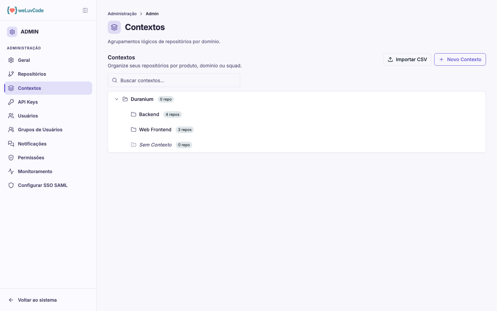

# Contextos

Um **contexto** é um agrupamento lógico de repositórios — por produto, domínio ou
squad. É a peça central da organização dos dados: o Score é agregado por
contexto, o Navigate pode ser restrito a um contexto, e o acesso das pessoas é
concedido por contexto.

## A árvore

Os contextos aparecem em árvore, com a contagem de repositórios de cada um.
Contextos podem ter **contexto pai**, o que permite hierarquias — uma área que se
subdivide em domínios, por exemplo.

Um nó **Sem Contexto** reúne os repositórios ainda não classificados. É o item a
observar depois de conectar repositórios novos: enquanto estiverem ali, não
entram em nenhuma visão por contexto.

## Criar um contexto

**Novo Contexto** abre um formulário curto:

| Campo | Observação |
| --- | --- |
| **Nome** | obrigatório |
| **Descrição** | opcional, até 250 caracteres |
| **Contexto pai** | define a posição na árvore |

**Importar CSV** permite criar vários de uma vez.

## O briefing do contexto

Abrir um contexto leva à sua tela de detalhe, que tem duas partes: o **briefing**
e a lista de repositórios.

O briefing é um texto livre de até 3000 caracteres com informações de negócio
sobre aquele conjunto de repositórios. Ele não é decorativo: **é usado pela IA
para contextualizar as análises daquele contexto.** O mesmo código analisado com
e sem briefing produz leituras diferentes, porque o modelo passa a saber o que o
sistema faz, que restrições existem e o que está em andamento.

O botão **Usar template** preenche o campo com uma estrutura de quatro partes:

| Seção do template | O que escrever |
| --- | --- |
| **Sobre este produto/domínio** | o que este conjunto de repositórios faz e qual o papel dele no negócio |
| **Stack e decisões técnicas** | linguagens, frameworks, bancos, padrões arquiteturais adotados e por quê |
| **Dependências e integrações** | outros times, serviços externos ou internos dos quais o domínio depende |
| **Contexto relevante para análise** | migrações em andamento, dívida técnica conhecida, restrições regulatórias, decisões recentes |

A última seção costuma ser a mais valiosa: é onde entram informações que não
estão no código e que mudam a interpretação dele — uma migração em curso explica
código duplicado, uma restrição regulatória explica uma validação aparentemente
redundante.

## Repositórios do contexto

Abaixo do briefing fica a lista de repositórios vinculados, cada um com seu
estado de monitoramento. **Adicionar** vincula repositórios ao contexto e
**Remover** desfaz o vínculo — sem excluir o repositório da organização, que
apenas volta para "Sem Contexto".

O contexto também pode ser editado ou excluído pelos botões no topo.
