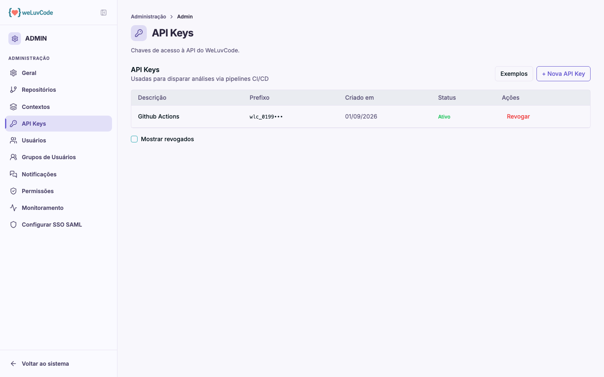

# API Keys

Chaves de acesso à API do WLC. Elas existem para um propósito específico:
**disparar análises a partir da esteira de CI/CD**, para que a documentação
gerada acompanhe o código sem intervenção manual.

## A tabela

| Coluna | Conteúdo |
| --- | --- |
| **Descrição** | o nome dado à chave na criação, que identifica seu uso |
| **Prefixo** | os primeiros caracteres da chave, para reconhecê-la sem expô-la |
| **Criado em** | data de emissão |
| **Status** | Ativo ou Revogado |
| **Ações** | **Revogar**, que invalida a chave imediatamente |

A caixa **Mostrar revogados** inclui as chaves desativadas na listagem.

## Criar uma chave

**Nova API Key** gera a chave, pedindo apenas uma **descrição** de até 200
caracteres — é ela que identifica o uso da chave na listagem. O valor completo é
exibido **uma única vez, no momento da criação** — depois disso, a listagem
mostra apenas o prefixo. Guarde-o no cofre de segredos da sua esteira nesse
momento; se perder, o caminho é revogar e gerar outra.

> Chaves de API são credenciais. Não as compartilhe em conversas, tickets ou
> documentos, e prefira revogar e emitir uma nova a reaproveitar uma chave que
> tenha sido exposta.

## Exemplos de integração

O botão **Exemplos** abre um guia com configurações prontas para reanálise
automática a cada push na branch principal, cobrindo **GitHub Actions, GitLab CI,
Azure DevOps, CircleCI, Bitbucket, Jenkins** e **cURL**, com botão para copiar.

O funcionamento é o mesmo em todas as plataformas:

1. A chave é guardada como **secret** na sua ferramenta de CI
2. O pipeline chama o endpoint de análise enviando a chave no cabeçalho
   `Authorization: Bearer`
3. A API responde **202 Accepted** e a análise roda em segundo plano, sem travar
   o pipeline

Como a resposta é assíncrona, o build não espera pela análise: o resultado
aparece na documentação do repositório quando o processamento termina.
