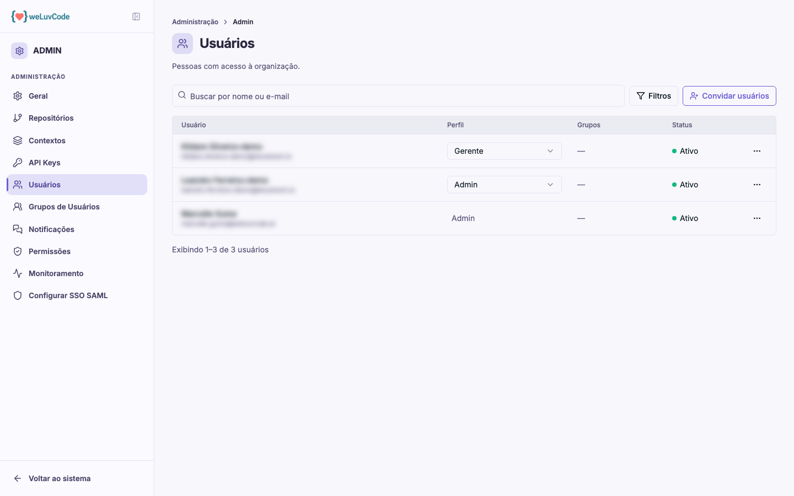

# Usuários

As pessoas com acesso ao workspace.

## A tabela

| Coluna | Conteúdo |
| --- | --- |
| **Usuário** | nome e e-mail |
| **Perfil** | o papel da pessoa, editável no próprio seletor da linha |
| **Grupos** | os grupos a que pertence, que determinam o que ela enxerga |
| **Status** | Ativo, Inativo, Pendente ou Expirado |

A busca filtra por nome ou e-mail, e **Filtros** permite recortar por status e
por situação do convite.

O administrador vê aqui todas as pessoas do workspace. Um gestor vê apenas as
dos grupos de que participa — a mesma restrição que vale para o resto do
produto, aplicada também a esta lista.

## Os perfis

O produto trabalha com cinco perfis: **Administrador**, **Gestor**, **Analista de
Segurança**, **Desenvolvedor** e **Visualizador**. O que cada um pode fazer está
em [Permissões](m2-08-permissoes.md).

Trocar o perfil de alguém é imediato: basta usar o seletor na linha da pessoa.

## Convidar pessoas

**Convidar usuários** envia convite por e-mail. Até a pessoa aceitar, ela aparece
na lista com status **Pendente**; convites não aceitos dentro do prazo passam a
**Expirado**, e o filtro de convites ajuda a encontrá-los para reenvio.

### O limite de usuários

O workspace tem um número máximo de usuários ativos, definido pelo plano
contratado. O diálogo de convite mostra quantas vagas ainda existem e recusa uma
lista de endereços maior do que o que cabe, dizendo quantos ainda podem entrar.

**Ao atingir o limite, o botão Convidar usuários fica desativado** e o produto
explica o motivo quando o cursor passa sobre ele. A partir daí há dois caminhos:
desativar alguém que não usa mais o produto, o que libera uma vaga na hora, ou
pedir mais usuários — e isso é feito abrindo um chamado com o time de suporte,
por envolver o plano contratado.

Convites pendentes não ocupam vaga enquanto não são aceitos. Quando há convites
em aberto, a tela exibe a contagem de vagas ocupadas ao lado da de pendentes,
para que o teto não seja atingido de surpresa.

## Perfil e visibilidade são coisas diferentes

Vale separar os dois conceitos, porque eles se confundem com frequência:

- O **perfil** define *o que a pessoa pode fazer* — administrar, apenas
  visualizar, e assim por diante
- Os **grupos** definem *o que a pessoa enxerga* — quais contextos, e portanto
  quais repositórios

Uma pessoa sem grupo algum pode não ver nenhum repositório, **e isso vale
inclusive para o perfil de Gestor**: o cargo amplia o que se pode fazer, não o
que se enxerga. Administrador é a única exceção — enxerga tudo,
independentemente de grupos. Ver [Grupos de Usuários](m2-06-grupos.md).

> No print, nomes e e-mails estão borrados por serem dados pessoais.
