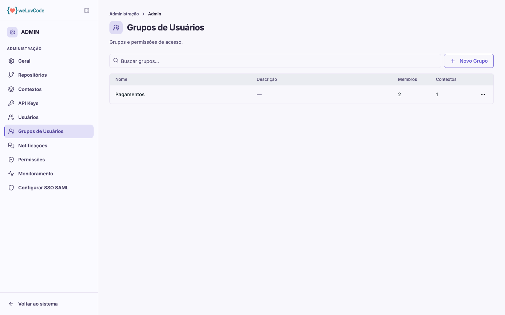

# Grupos de Usuários

Grupos são o mecanismo de **visibilidade** do produto: eles respondem quem
enxerga o quê.

## O que um grupo reúne

Um grupo junta duas coisas:

- **pessoas** — os membros do grupo
- **contextos** — os contextos cujos repositórios esses membros poderão ver

As pessoas de um grupo passam a enxergar os repositórios dos contextos vinculados
a ele, e não os demais. As colunas da lista refletem isso: nome, descrição,
número de membros e número de contextos.

> **Administrador é a única exceção.** Quem tem perfil de administrador
> visualiza todos os repositórios do workspace, esteja ou não em algum grupo.
> Todos os demais perfis — **Gestor**, **Analista de Segurança**,
> **Desenvolvedor** e **Visualizador** — enxergam apenas o que seus grupos
> concedem.

## O Gestor depende de grupo como qualquer outro perfil

Vale destacar, porque contraria a intuição de que um cargo de gestão enxerga a
organização inteira: **um gestor vê apenas os contextos dos grupos de que é
membro**, e os repositórios desses contextos.

Três consequências práticas:

- **Gestor sem grupo não enxerga nada.** Não é uma visão parcial nem uma lista
  vazia em uma tela só: sem grupo, não há repositório, contexto ou Score a
  exibir. É o mesmo comportamento que vale para os demais perfis restritos.
- **Não existe "dono do grupo".** O gestor entra no grupo como membro comum, do
  mesmo jeito que qualquer outra pessoa. O grupo reúne pessoas e contextos, sem
  papel diferenciado entre os membros.
- **Gestor não administra grupos.** Esta seção do Painel Admin é exclusiva do
  administrador. O motivo é direto: quem pudesse editar o próprio grupo poderia
  ampliar o próprio alcance, e a restrição deixaria de ser restrição.

A leitura disso na prática está em [Workspace](m1-04-workspace.md): para um
gestor, o nível "workspace" passa a significar o recorte que ele enxerga.

## Criar um grupo

**Novo Grupo** abre um assistente de três passos:

**Passo 1 — Identificação.** Nome do grupo e descrição.

**Passo 2 — Membros** (opcional). Lista das pessoas do workspace, com busca,
para marcar quem entra.

**Passo 3 — Contextos** (opcional). Lista dos contextos existentes, para marcar
quais o grupo poderá ver.

Os dois últimos passos são opcionais: dá para criar o grupo e preencher depois,
pelo menu de ações na linha. Mas um grupo sem contextos não concede visibilidade
alguma, e um grupo sem membros não afeta ninguém.

## Efeito no Navigate

A visibilidade por grupo também vale para o assistente: com a filtragem por
usuário ativa, todo perfil que não seja administrador recebe respostas apenas
sobre os repositórios a que tem acesso. O Navigate não contorna a restrição de
visibilidade.
