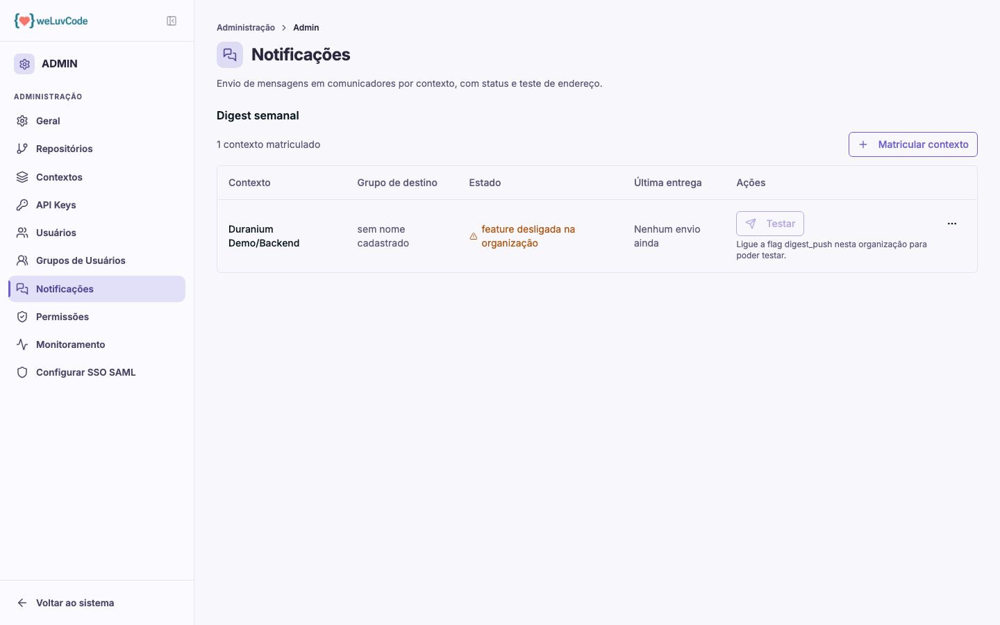

# Notificações

Envio de mensagens em comunicadores, organizado por contexto. É a única parte do
produto que envia informação para fora dele.

## Digest semanal

O recurso disponível é o **Digest semanal**: um resumo periódico do contexto,
entregue no comunicador do time.

Cada contexto precisa ser **matriculado** individualmente, através de **Matricular
contexto**, informando o grupo de destino. A tabela acompanha cada matrícula:

| Coluna | Conteúdo |
| --- | --- |
| **Contexto** | o contexto matriculado |
| **Grupo de destino** | para onde as mensagens vão |
| **Estado** | se o envio está apto a acontecer |
| **Última entrega** | quando o último digest saiu |
| **Ações** | **Testar**, que dispara um envio de verificação |

## O estado é a coluna a observar

Matricular o contexto não basta. O envio depende de a feature flag `digest_push`
estar ligada para a organização. Enquanto ela estiver desligada, a linha exibe
*feature desligada na organização*, o botão **Testar** fica indisponível, e a
instrução aparece na própria linha.

Um grupo de destino sem endereço cadastrado também é sinalizado ali, na mesma
coluna — o que evita descobrir o problema só quando o digest não chega.
