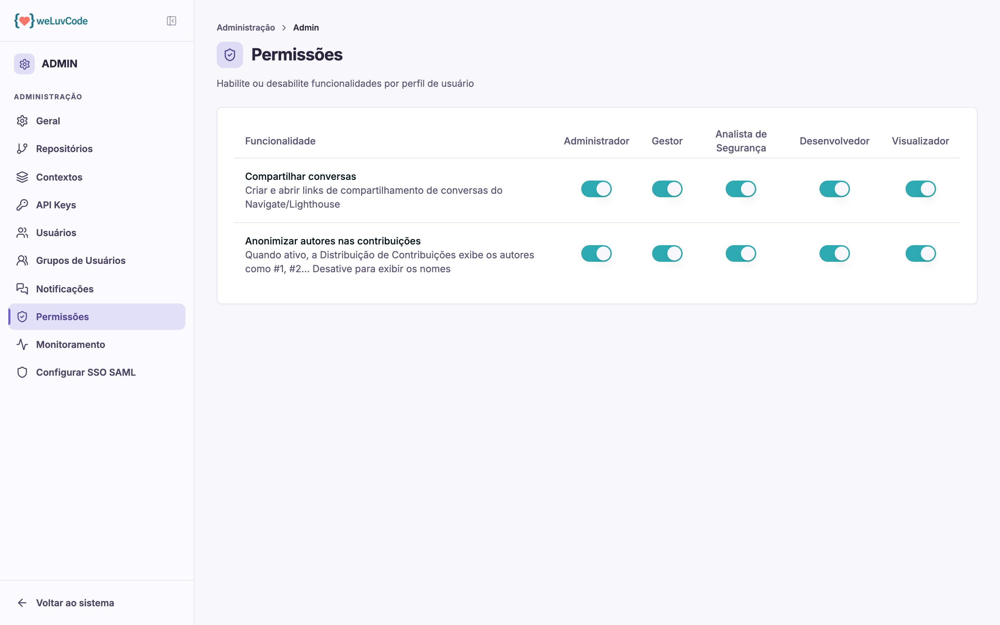

# Permissões

Define, por perfil de usuário, quais funcionalidades ficam habilitadas.

## A matriz

As linhas são funcionalidades e as colunas são os cinco perfis do produto:
**Administrador**, **Gestor**, **Analista de Segurança**, **Desenvolvedor** e
**Visualizador**. Cada cruzamento tem um interruptor.

Esta matriz não tem relação com **visibilidade**. Ela liga e desliga
funcionalidades por perfil; quais repositórios cada pessoa enxerga é decidido em
[Grupos de Usuários](m2-06-grupos.md), e nenhum interruptor daqui amplia o
alcance de ninguém.

## As funcionalidades configuráveis

| Funcionalidade | Efeito quando ativa |
| --- | --- |
| **Compartilhar conversas** | o perfil pode criar e abrir links de compartilhamento de conversas do Navigate |
| **Anonimizar autores nas contribuições** | a Distribuição de Contribuições exibe os autores como #1, #2, #3…; desativar mostra os nomes |

## Sobre a anonimização

A segunda merece decisão consciente: ela controla se nomes de pessoas aparecem
associados a métricas de contribuição.

Manter a anonimização ativa é a opção mais conservadora do ponto de vista de
dados pessoais, e é coerente com o desenho do produto — que, como descrito em
[Métricas](m1-03-metricas.md), não produz score individual por desenvolvedor. As
métricas de distribuição existem para revelar **concentração de conhecimento**,
não para avaliar pessoas.

Desativar a anonimização transforma um indicador de risco organizacional em algo
que pode ser lido como avaliação individual. É uma escolha do workspace, e vale
que seja explícita.
