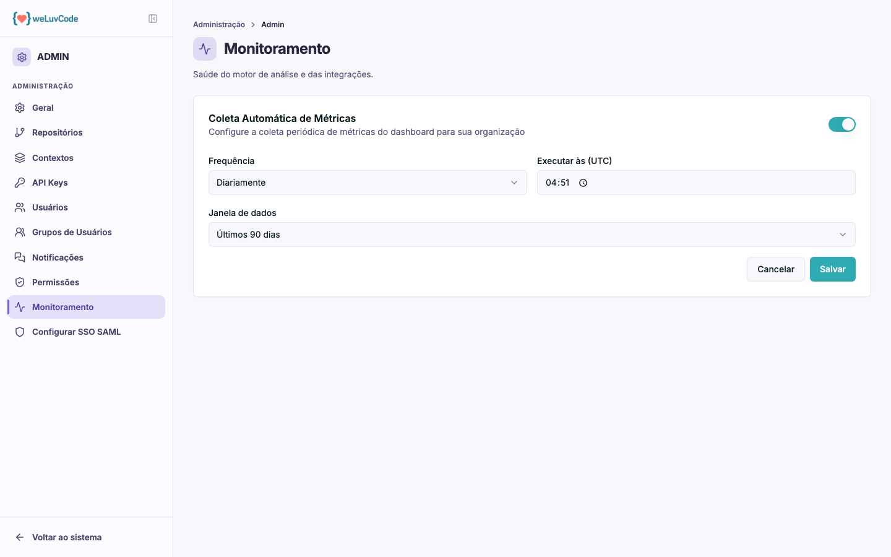

# Monitoramento

Saúde do motor de análise e das integrações, e o controle de com que frequência
os dados são coletados.

## Coleta Automática de Métricas

O bloco principal controla a periodicidade da coleta que alimenta o Score e as
métricas do painel. O interruptor no canto liga e desliga a coleta automática.

| Campo | O que define |
| --- | --- |
| **Frequência** | de quanto em quanto tempo a coleta roda — diariamente, por exemplo |
| **Executar às (UTC)** | o horário da execução, em UTC |
| **Janela de dados** | o período considerado em cada coleta, por exemplo os últimos 90 dias |

Dois pontos que evitam confusão:

**O horário é em UTC**, não no fuso local. Uma coleta às 04:51 UTC acontece por
volta das 01:51 no horário de Brasília.

**A janela de dados não é a mesma coisa que a frequência.** A frequência diz de
quanto em quanto tempo a coleta roda; a janela diz quanto tempo para trás cada
coleta enxerga. Uma coleta diária com janela de 90 dias recalcula, todo dia, uma
fotografia dos últimos 90 dias.

Desligar a coleta automática não apaga o histórico já reunido — apenas interrompe
a atualização, e o painel passa a mostrar dados cada vez mais antigos.
