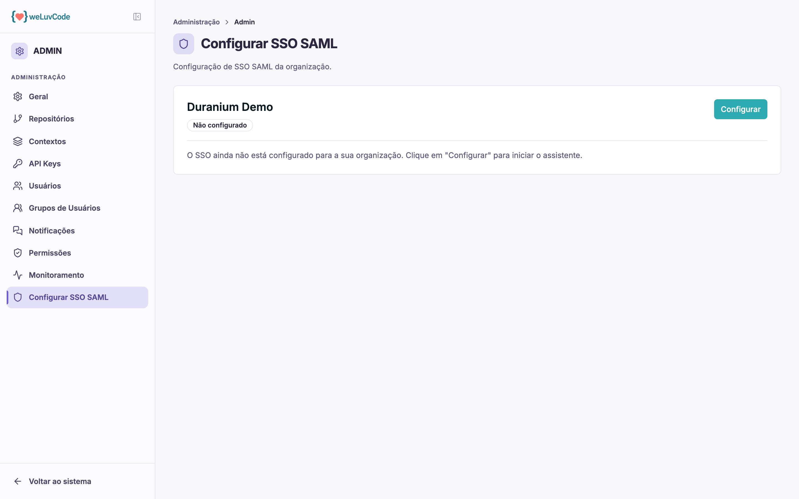

# Configurar SSO SAML

Autenticação corporativa via SAML, para que as pessoas entrem no WLC com as
credenciais que já usam na empresa.

## O estado da configuração

A tela mostra a situação do SSO do workspace, que pode ser:

| Estado | Significado |
| --- | --- |
| **Não configurado** | nenhum provedor de identidade foi conectado |
| **Pendente** | a configuração foi iniciada e ainda não concluída |
| **Ativo** | o login por SSO está funcionando |
| **Desabilitado** | a configuração existe, mas está desligada |
| **Falhou** | a validação com o provedor não passou |

O botão **Configurar** abre o assistente de configuração, onde se informam os
dados do provedor de identidade.

## Efeito no login

Com o SSO ativo, a tela de acesso passa a oferecer **Entrar com SSO**, ao lado do
login por e-mail e senha — como descrito em [Acesso](m1-02-acesso.md).
