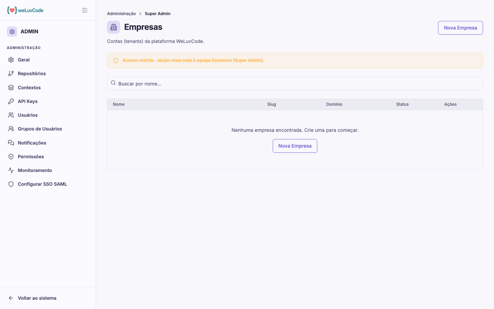

# Super Admin

Seções restritas à equipe Duranium, que administram a plataforma como um todo em
vez de uma organização específica. A própria tela avisa dessa restrição.

## Empresas

Lista as contas (tenants) da plataforma, com nome, slug, domínio e status, e
permite criar uma nova empresa. É a partir daqui que se chega às configurações
por organização de cada cliente, incluindo SSO e feature flags específicas.

## Feature flags e Termos de uso

Duas outras seções pertencem a este grupo:

- **Feature flags** — liga e desliga funcionalidades por organização. É o
  mecanismo por trás de recursos que existem no produto mas não estão ativos em
  todas as contas, como o `digest_push` mencionado em
  [Notificações](m2-07-notificacoes.md)
- **Termos de uso** — versões dos termos, com estados de rascunho, ativa e
  arquivada

> Estas duas telas não estão documentadas com imagem: elas exigem as permissões
> `admin.feature-flags` e `admin.terms`, que a conta usada na captura não possui.
